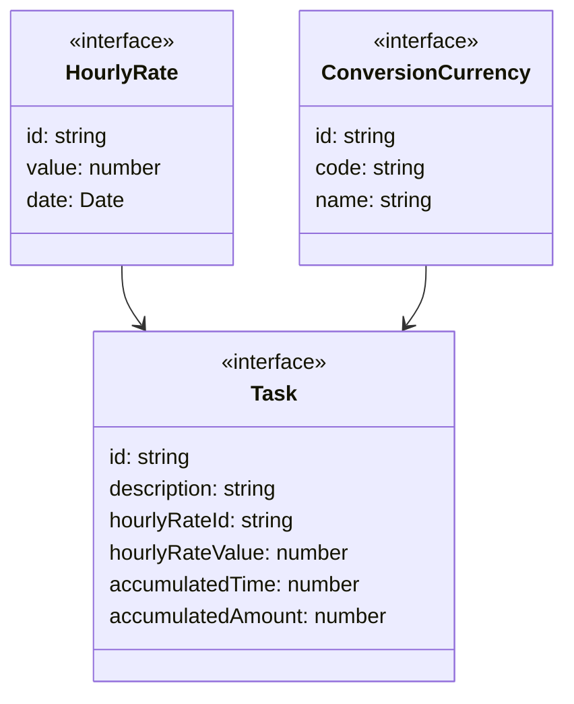

# WorkTracker

WorkTracker es una aplicación web desarrollada en React que ayuda a los freelancers a rastrear sus horas de trabajo y el precio por hora en diferentes monedas.

## Requerimientos

- Registro de precio por hora de trabajo
- Calculo de sueldo por hora, diario, mensual y anual.
- Seleccion y conversión de monedas
- Cronómetro para contabilizar las horas de trabajo
- Notificación por cada hora de trabajo completada
- Reporte del monto total a cobrar por tarea

## Uso

Siga estos pasos para comenzar a usar la aplicación web:

1. Ingrese el precio por hora en su moneda local.
2. Seleccione las monedas de conversion de su conveniencia.
3. Cree una tarea
3. Inicie cronómetro para contabilizar el tiempo dedicado a la tarea.
4. La aplicación acumulará el monto a cobrar en tiempo real.
5. Sera notificado cada vez que se complete una hora de trabajo.

## Entidades

Las entidades que maneja la aplicación son las siguientes:

### HourlyRate

Representa el precio por hora de trabajo.

| Propiedad | Tipo   | Descripción                      |
| --------- | ------ | -------------------------------- |
| id        | string | Identificador único del precio   |
| value     | number | Valor del precio                 |
| date      | Date   | Fecha en que se registró el precio|

### ConversionCurrency

Representa una moneda de conversión.

| Propiedad      | Tipo   | Descripción                           |
| -------------- | ------ | ------------------------------------- |
| id             | string | Identificador único de la moneda       |
| code           | string | Código de la moneda (ej. USD, PEN, BOB)|
| name           | string | Nombre de la moneda                    |

### Task

Representa una tarea que se está trabajando.

| Propiedad         | Tipo   | Descripción                                      |
| ----------------- | ------ | ------------------------------------------------ |
| id                | string | Identificador único de la tarea                  |
| description       | string | Descripción de la tarea                          |
| hourlyRateId      | string | Identificador del precio por hora de la tarea    |
| hourlyRateValue   | number | Valor del precio por hora de la tarea            |
| accumulatedTime   | number | Tiempo acumulado de la tarea en minutos           |
| accumulatedAmount | number | Monto acumulado de la tarea en la moneda de base |

### Diagram

