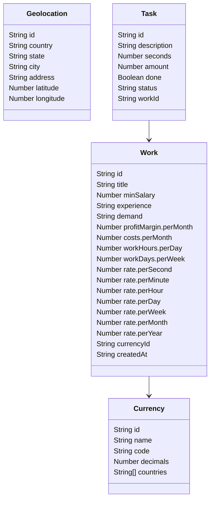

# Work Tracker

Work Tracker allows you to calculate the monetary value of your daily tasks. It provides tools for recording and managing tasks, as well as visualizing the associated monetary value.

## APIs

- OpenStreetMapAPI: To obtain geolocation information and address data.
- ExchangeRatesAPI: To retrieve currency exchange rates and perform monetary conversions.

## Entities

### Geolocation

| Property  | Type   | Description                          |
| --------- | ------ | ------------------------------------ |
| id        | string | Unique identifier of the entity      |
| country   | string | Country                              |
| state     | string | State or province                    |
| city      | string | City of the task                     |
| address   | string | Complete address                     |
| latitude  | number | Geographic latitude                  |
| longitude | number | Geographic longitude                 |

### Currency

| Property  | Type     | Description                                       |
| --------- | -------- | ------------------------------------------------- |
| id        | string   | Unique identifier of the entity                   |
| name      | string   | Name of the currency                              |
| code      | string   | Currency code                                     |
| decimals  | number   | Number of decimal places for the currency         |
| countries | string[] | List of countries where the currency is accepted  |

### Work

| Property              | Type   | Description                                    |
| --------------------- | ------ | ---------------------------------------------- |
| id                    | string | Unique identifier of the work                  |
| title                 | string | Title or name of the work                      |
| minSalary             | number | National minimum salary                        |
| experience            | string | Your level of experience                       |
| demand                | string | The demand level of your profession            |
| profitMargin.perMonth | number | Monthly profit margin                          |
| costs.perMonth        | number | Your monthly living costs                      |
| workHours.perDay      | number | Number of work hours per day                   |
| workDays.perWeek      | number | Number of work days per week                   |
| rate.perSecond        | number | Rate per second of work                        |
| rate.perMinute        | number | Rate per minute of work                        |
| rate.perHour          | number | Rate per hour of work                          |
| rate.perDay           | number | Rate per day of work                           |
| rate.perWeek          | number | Rate per week of work                          |
| rate.perMonth         | number | Rate per month of work                         |
| rate.perYear          | number | Rate per year of work                          |
| currencyId            | string | ID of the currency used in the work            |
| createdAt             | string | Date and time when the work was created        |

### Task

| Property    | Type    | Description                                   |
| ----------- | ------- | --------------------------------------------- |
| id          | string  | Unique identifier of the task                 |
| description | string  | Description of the task                       |
| seconds     | number  | Time spent on the task in seconds             |
| amount      | number  | Accumulated amount to be charged for the task |
| done        | boolean | Indicates whether the task is completed       |
| status      | string  | Status of the task                            |
| startedAt   | string  | Date and time when the task was started       |
| createdAt   | string  | Date and time when the task was created       |
| workId      | string  | ID of the work associated with the task       |

## Graph

## App Structure

